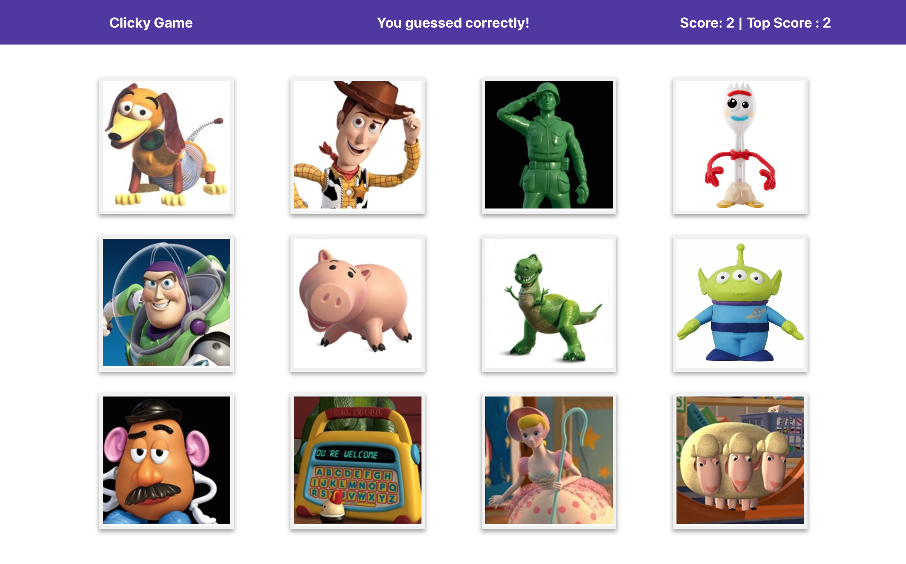

## Clicky Game

Clicky Game is a memory game built with React. When users click on an image to start, the scoreboard will update whenever you guess correctly or incorrectly. The top score is the highest score you've ever earned in this game. The cards will shuffle automatically when you click on a card. 

### Deployed Link: 
https://dzhangcoder.github.io/Clicky-Game/

### How to Play?

Click on any image to start, and the card would shuffle everytime you click on an image. The rule of the game is to never click on the same image twice. You win by clicking on all the 12 images without repetition. 

### Technologies Used:
- React.js 
- Node
- NPM

### Run the game in your local computer using `npm start`

Open your terminal of the right directory and type `npm start`. 
Then, open [http://localhost:3000](http://localhost:3000) to view it in the browser.

### Contact Information

General Inquiries at ddzhang2018@gmail.com

